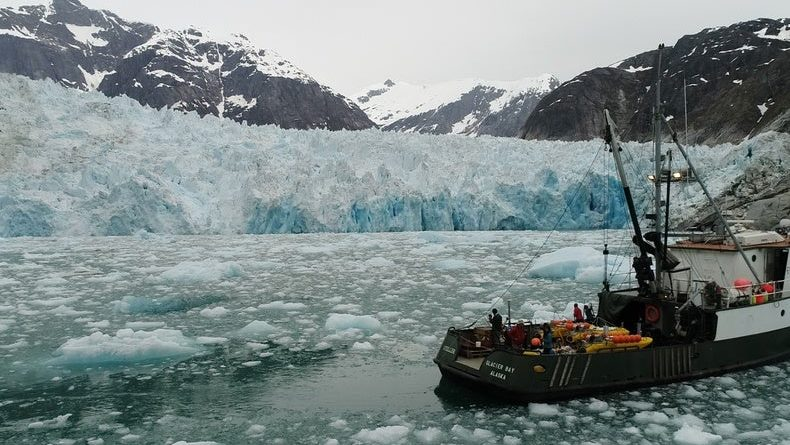

###### article-link: [https://www.scientificamerican.com/article/ice-sheets-are-eroded-by-upside-down-rivers/#]()

## Vocabulary 

| words from the text | synonym/explanation         |
| ------------------- | --------------------------- |
| ice shelves         | bloc of glace               |
| basal channels      | space between bloc of glace |
| buoyant plumes      | movement of ocean water     |
| split               | break                       |
## Analysis table 

| Researchers         | Karen Alley and Ted SCambos                                                             |
| ------------------- | --------------------------------------------------------------------------------------- |
| Publish in          | 11/10/2019                                                                              |
| General topic       | This topic talk about  how warmer ocean water creates melt of the Antarctica's glaciers |
| What was examined ? | degradation of layer of ice                                                             |
| Conclusion          | we must rapidly find any process which can remove a glacier                             |
| Remaining questions | how much melty of the glaciers increase temperature and sea-level                       |

<https://www.scientificamerican.com/article/wheres-my-elephant-https://www.scientificamerican.com/article/ice-sheets-are-eroded-by-upside-down-rivers/

