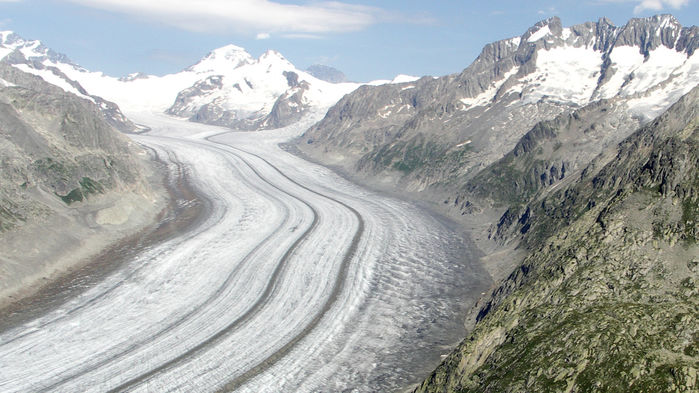

##### The Aletsch Glacier in Switzerland

##### Magazine name: [Science mag](https://www.sciencemag.org/news/2019/08/europes-record-heat-melted-swiss-glaciers)

## Vocabulary

| words from the text       | synonym/explanation                        |
| ------------------------- | ------------------------------------------ |
| sweltering                | when something make respiration difficult  |
| downward                  | rate decrease                              |
| stunned to stumble across | to see something that was not planned      |
| hike                      | a break                                    |

## Analysis table

| Researchers                 | Chealsea Harvey, reporter at eenews                                                                          |
| ------------------------- | ------------------------------------------ |
| Published in ?              | August 5, 2019                                                                                               |
| General topic               | This report talk about a high melting Switzerland's glaciers                                                                                      caused by a rough summer which occured at june to july |
| Procedure/What was examined | Results of the reseach did by GlAMOS (Glacier Monitoring Network), The Tignes Ski ressort in the french Alps announced, observation of mountaineer Bryan Mestre and publication in the cryosphere. |
| Conclusions/discovery       | we are regulary seeing rough summer that we increase melty of the Europe'glaciers                             |

