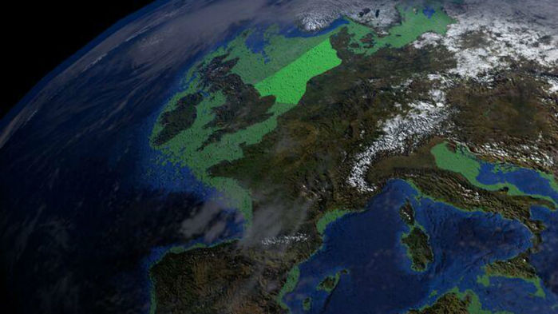

Name of magazine and url:
[science mag](https://www.sciencemag.org/news/2019/05/lost-plains-doggerland-emerge-north-sea)

one part of 3D colorado-size plot Doggerland's map 

## Vocabulary

| words from the text       | synonym/explanation                        |
| ------------------------- | ------------------------------------------ |
| seabed                    | benthic environement/going deep to the sea |
| pinpoint                  | point which that give precision            |
| settlement                | dwelling/residence                         |

## Analysis table

| Researchers                     | Alex Fox                                                                                                                            |
| ------------------------------- | --------------------------------------------------------------------------------------------------------------------------------- |
| Published in ?                  | 09, may 2019                                                                                                                      |
| General topic ?                 | This article talk about an exploration of Doggerland  by scientits using two methods to have more informations about mesolitic human                                                                      |
| Procedure / what was examined ? | Scientits created 3D map of colorado-size plot of Doggerland and took core samples from the sea floor by using specialized ship                                                                 |
| Conclusion / discovery ?        | 3D map had revealed Doggerland's hill, rivers and coats. Scientits hope to find human relics and sources of plant and animal DNA which can reveal a ecosystem                                                    |

