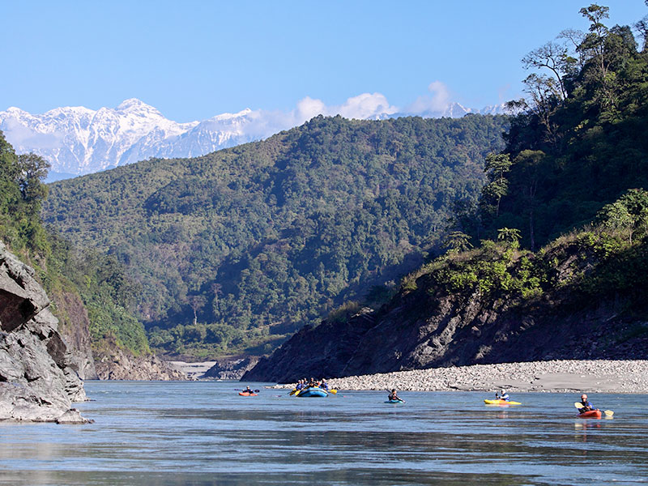

name of magazine and url:

[NewScientist](https://www.newscientist.com/letter/mg24432543-000-vanishing-glaciers-will-be-deadly-for-people-in-asia/)

### Vocabulary

| Words from the text 	| Synonym/explanation in english 	|
|---------------------	|--------------------------------	|
| vanishing           	| disappearance                  	|
| fed                 	| to fill in with                	|
| flood               	| to be full                     	|
| diminished          	| go down                        	|

### Analysis table

| Researcher?                  	| Alex Hromas                                                                                                                                                               	|
|------------------------------	|---------------------------------------------------------------------------------------------------------------------------------------------------------------------------	|
| published in?                	| 30 october 2019                                                                                                                                                           	|
| General topic?               	| melting of the glaciers in Asia will cause some of its rivers to dry up                                                                                                   	|
| procedure/what was examined? 	| they used information about former research  	|
| conclusions/discovery        	| before too long, some rivers in Asia will be empty in the dry season                                                                                                      	|
