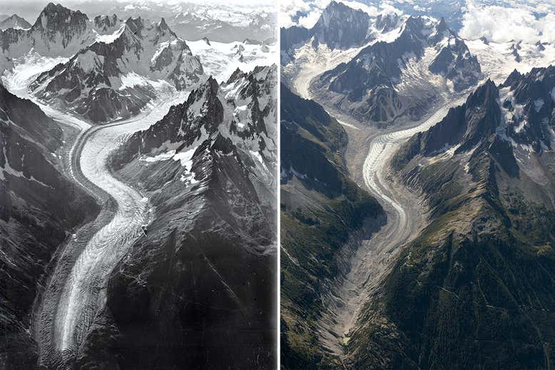

name of magazine and url:

[NewScientist](https://www.newscientist.com/article/mg24332483-600-special-report-how-climate-change-is-melting-frances-largest-glacier/)

### Vocabulary

| Words from the text | Synonym / explanation   |
| ------------------- | ----------------------- |
| The fate            | The future of something |
| remote              | Be away                 |
| To encounter        |  To meet                |
| Shriking            | Decreasing              |
| To carve            | To sculpt               |
| to thaw             | to melt                 |

### Analysis table

| Researchers?                   | Intergovernmental Panel on Climate Change (IPCC) and Christian Vincent                                                                                                                                                                                                                         |
| ------------------------------ | ---------------------------------------------------------------------------------------------------------------------------------------------------------------------------------------------------------------------------------------------------------------------------------------------- |
| Published in?                  | September 18, 2019                                                                                                                                                                                                                                                                             |
| General topic?                 | The great glaciers of France like the Argentiere glacier and the frozen water masses like the Mer de Glace have suffered a significant thaw. This thaw is visible not only on tourist sites but also on flora and fauna.                                                                       |
| Procedure / what was examined? | Researchers used statistical data and images to compare ice levels at different times in the 1960s and 2000s                                                                                                                                                                                   |
| Conclusions / discovery?       | The length of the Argentiere glacier and the Mer de Glace have decreased by 800 meter . This reduction has a significant impact not only on the fauna with the resurgence of birds like Rock Ptarmigan, on the flora with the displacement of the plants like the Genepi but also on tourism.  |
