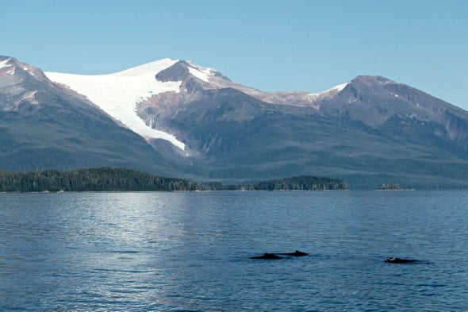

name of magazine and url:

[Scientific American](https://blogs.scientificamerican.com/observations/iceless-in-alaska/)

### Vocabulary

| Word from the text | Synonym / explanation in english  |
| ------------------ | --------------------------------- |
| hypoxic            | low rate of oxygen in an organism |
| Ice shelves        | bloc of ice                       |
| Inupiat            | native people of Alaska           |
| ever recorded      | a thing we have never seen before |
| shockingly         | excessively bad                   |
| spawning season    | season of good fishing            |

### Analysis table

| Researchers ?                   | Kristin Hettermann, reporter                                                                            |
| ------------------------------- | ------------------------------------------------------------------------------------------------------- |
| Published in ?                  | 18 November, 2019                                                                                       |
| General topic ?                 | Impact of rude summer on glaciers of Alaska and consequences on environment and activities              |
| Procedure / what was examined ? | They used results of earlier research and  analysed change of environment  in Alaska                    |
| Conclusions / discovery ?       | Temperature has been increasing more and more and it has been bad consequences on environment in Alaska |
| Remaining question ?            | How can we manage clearly climatic change?                                                              |
