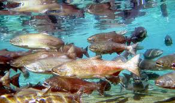

name of magazine and url:

[Scientific American](https://blogs.scientificamerican.com/observations/iceless-in-alaska/)

### Vocabulary

| Words from the text | Synonym / explanation in english                         |
| ------------------- | -------------------------------------------------------- |
| Hypoxic             | Decrease in the amount of oxygen arriving at the tissues |
| Inupiat             | A group of Alaska natives                                |
| Spawning season     | Reproduction period                                      |
| Ebb                 | Water reflux                                             |

### Analysis table

| Researcher?                    | NASA (National Aeronautics and Space Administration) and John Muir                                                                                                                                                                  |
| ------------------------------ | ----------------------------------------------------------------------------------------------------------------------------------------------------------------------------------------------------------------------------------- |
| Published?                     | November 18, 2019                                                                                                                                                                                                                   |
| General topic?                 | The harsh summer from June to July 2019,  caused the melting of ice present not only on mountains but also on the surface of water. This melting had large consequences on the ecosystem and on salmon fishing.                     |
| Procedure / what was examined? | For research, we used NASA's satellite data, National Weather Service's data and studies published in Inside Climate News                                                                                                           |
| Conclusions / discovery?       | Alaska's glaciers are experiencing unprecedented melting. It is due to global warming with consequences on the ecosystem. To overcome this phenomenon, solutions such as the local production of energy and food have been proposed |
