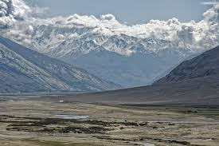

name of magazine and url:

[Science Daily](https://www.sciencedaily.com/releases/2020/02/200211121512.htm)

### Vocabulary

| Words from the text | Synonym / explanation in english             |
| ------------------- | -------------------------------------------- |
| Landslides          | when ground of a place move to another place |
| Floods              | inondations                                  |
| To assesse          | to estimate                                  |
| Roadway             | place of the road where car circulate        |
| Hazard              | the risk                                     |
| Nowcast             | prevision of now                             |
| to trigger          | to induce                                    |

### Analysis table

| Researcher organization        | NASA / Goddard Space Flight Center                                                                                              |
| ------------------------------ | ------------------------------------------------------------------------------------------------------------------------------- |
| Published in ?                 | February 11, 2020                                                                                                               |
| General topic?                 | Rainfall induce landslide on High Mountain Asia                                                                                 |
| Procedure / What was examined? | Scientists used satellite data of global precipitation, to estimate future landslides Asia High Mountain                        |
| Conclusions?                   | Study revealed landslides in Asia High Mountain will increase. Knowing that, decision-makers had prepared for future disasters  |
| Remaining questions?           | scientists wanted to expand research  to another areas of the world principally in the United States                            |

