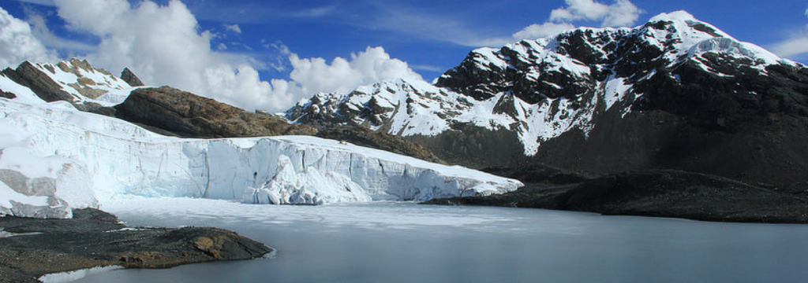

name of magazine and url: 

[Science Daily](https://www.sciencedaily.com/releases/2019/10/191007100421.htm)

### Vocabulary

| Words from the text | Synonym / explanation     |
| ------------------- | ------------------------- |
| To retreat          | To decrease               |
| To ascertain        | To verify                 |
| Landsat image       | Satellite image of region |
| To track            | Watch the evolution       |
| Shrinkage           | Drastic decrease          |
| Forecasts           | What we expect            |

### Analysis table

| Researchers                    | Dr Thorsten Seehaus and his team                                                                                                                                                                                                                                                                                                |
| ------------------------------ | ------------------------------------------------------------------------------------------------------------------------------------------------------------------------------------------------------------------------------------------------------------------------------------------------------------------------------- |
| Published in ?                 | October 7, 2019                                                                                                                                                                                                                                                                                                                 |
| General topic ?                | The Peruvian glaciers  which represent majority of European glaciers are melting considerably. This phenomenon has many consequences.                                                                                                                                                                                           |
| Procedure / what was examined? | Researchers used satellite data, Landsat images. They also investigated Peruvian glaciers.                                                                                                                                                                                                                                      |
| Conclusions                    | Mass and area of glaciers had been decreasing considerably. This decrease impact on the people and the economy of Peru. it also caused many damages and deaths. The research made it possible to give more information on the development of glaciers  as well as, on the strategies to be implemented in the event of melting. |
| Remaining questions            |   /                                                                                                                                                                                                                                                                                                                             |

